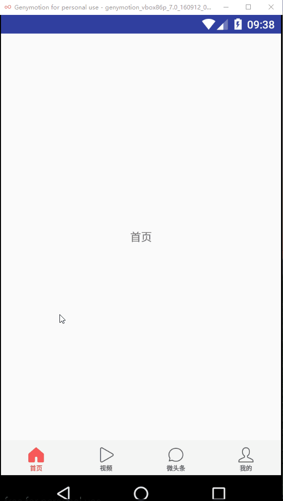
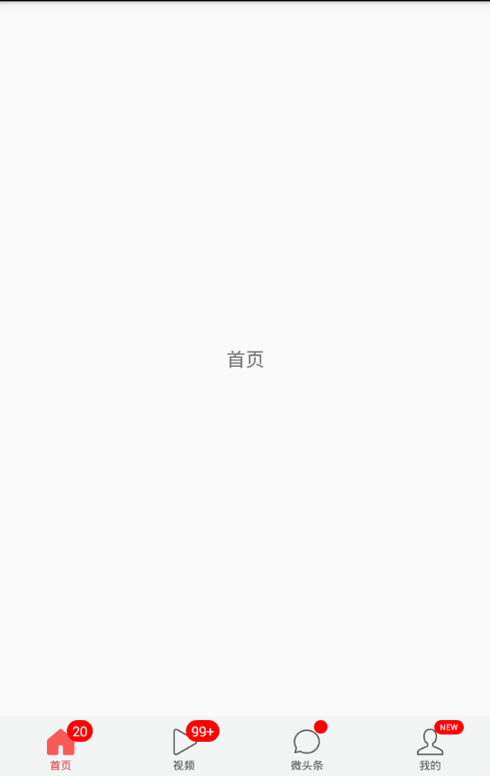
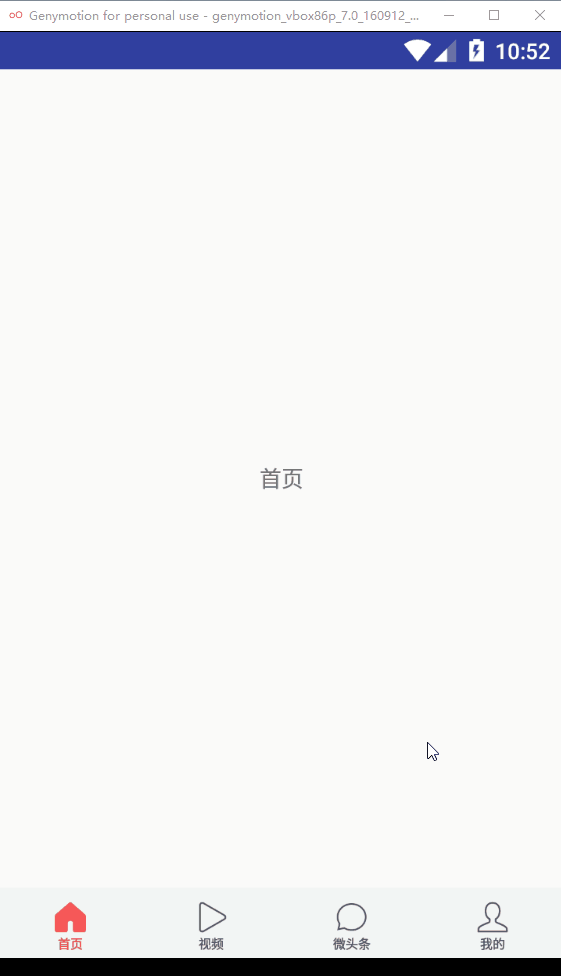

[中文(Chinese)](https://github.com/chaychan/BottomBarLayout)

### Introduction
&emsp;&emsp;Currently, App on the market almost has a navigation bar at the bottom, so we often need to use this during development. Although there are many tools on the github packaged bottom navigation bar, such as bottombar, alphaIndicator Swipe gradient bottom controls etc., but these controls are not particularly easy to use due to too many functions and no detailed documentation. Sometimes we just want a simple bottom navigation, but we don't want to go One by one in the layout of the LinearLayout or RadioGroup, and then change the tab icon, let ViewPager jump to the corresponding page and a series of tedious operations, this time, you can use BottomBarLayout, simply can achieve the following effect:

### Demo

#### Display unread, show red dot, display message

### V1.1.2 update instructions（2018-03-20）

- Add attributes to modify unread font colors and background

- Add attributes to modify prompt text font colors and background

- Add attributes to modify prompt point background

### V1.1.1 update instructions（2018-02-27）

- Repair must be set up ViewPager problems, can be modified to set or not set；

- Modify the click callback, callback more than a previousPosition (last page location)

- Add two usage patterns

### V1.0.7 update instructions（2018-01-05）

- Increase the threshold for unreadable attributes and set the properties for smooth transitions；

- Remove oriention restrictions。

### V1.0.6 update instructions（2017-12-19）

- Add slide listener, callback onItemSelected ()

### V1.0.4 update instructions（2017-10-10）

- Increase the number of unread, tips red dot, suggesting the function of the message

### Usage

#### Attribute introduction

        <!--Default icon-->
        <attr name="iconNormal" format="reference"/>

        <!--Selected icon-->
        <attr name="iconSelected" format="reference"/>

        <!--Bottom text-->
        <attr name="itemText" format="string"/>

        <!--Bottom text size-->
        <attr name="itemTextSize" format="dimension"/>

        <!--Default bottom text color-->
        <attr name="textColorNormal" format="color"/>

        <!--Selected bottom text color-->
        <attr name="textColorSelected" format="color"/>

        <!--The top of the text and icon-->
        <attr name="itemMarginTop" format="dimension"/>

        <!--Whether to open the touch background effect-->
        <attr name="openTouchBg" format="boolean"/>

        <!--Set touch background-->
        <attr name="touchDrawable" format="reference"/>

        <!--Set the width of the icon-->
        <attr name="iconWidth" format="dimension"/>

        <!--Set the height of the icon-->
        <attr name="iconHeight" format="dimension"/>

        <!--Set the padding of BottomBarItem-->
        <attr name="itemPadding" format="dimension"/>

        <!--Set unread font size-->
        <attr name="unreadTextSize" format="dimension"/>
 		<!--Set unread font color-->
        <attr name="unreadTextColor" format="reference"/>
        <!--Set unread font background-->
        <attr name="unreadTextBg" format="reference"/>

        <!--Set the message font size-->
        <attr name="msgTextSize" format="dimension"/>
		<!--Set the message font color-->
        <attr name="msgTextColor" format="reference"/>
        <!--Set the message font background-->
        <attr name="msgTextBg" format="reference"/>

        <!--Set the message prompt point background-->
        <attr name="notifyPointBg" format="reference"/>

        <!--Set the number of unread array thresholds greater than the threshold to be displayed as n + n as the set threshold-->
        <attr name="unreadThreshold" format="integer"/>

#### Configuration in the layout file

In the xml file, configure BottomBarLayout to wrap the sub-item BottomBarItem
    
    <?xml version="1.0" encoding="utf-8"?>
	<LinearLayout
	    xmlns:android="http://schemas.android.com/apk/res/android"
	    xmlns:app="http://schemas.android.com/apk/res-auto"
	    android:layout_width="match_parent"
	    android:layout_height="match_parent"
	    android:orientation="vertical"
    >

    <android.support.v4.view.ViewPager
        android:id="@+id/vp_content"
        android:layout_width="match_parent"
        android:layout_height="0dp"
        android:layout_weight="1"
        ></android.support.v4.view.ViewPager>

    <com.chaychan.library.BottomBarLayout
        android:id="@+id/bbl"
        android:layout_width="match_parent"
        android:layout_height="45dp"
        android:orientation="horizontal"
        android:gravity="center"
        android:layout_gravity="center"
        android:background="@color/tab_gb"
        >

        <com.chaychan.library.BottomBarItem
            android:layout_width="0dp"
            android:layout_weight="1"
            android:layout_height="match_parent"
            app:iconNormal="@mipmap/tab_home_normal"
            app:iconSelected="@mipmap/tab_home_selected"
            app:itemText="首页"
            app:textColorNormal="@color/tab_normal_color"
            app:textColorSelected="@color/tab_selected_color"
            app:itemTextSize="8sp"
            app:itemMarginTop="-5dp"
            />

        <com.chaychan.library.BottomBarItem
            android:layout_width="0dp"
            android:layout_weight="1"
            android:layout_height="match_parent"
            app:iconNormal="@mipmap/tab_video_normal"
            app:iconSelected="@mipmap/tab_video_selected"
            app:itemText="视频"
            app:textColorNormal="@color/tab_normal_color"
            app:textColorSelected="@color/tab_selected_color"
            app:itemTextSize="8sp"
            app:itemMarginTop="-5dp"
            />

        <com.chaychan.library.BottomBarItem
            android:layout_width="0dp"
            android:layout_weight="1"
            android:layout_height="match_parent"
            app:iconNormal="@mipmap/tab_micro_normal"
            app:iconSelected="@mipmap/tab_micro_selected"
            app:itemText="微头条"
            app:textColorNormal="@color/tab_normal_color"
            app:textColorSelected="@color/tab_selected_color"
            app:itemTextSize="8sp"
            app:itemMarginTop="-5dp"
            />

        <com.chaychan.library.BottomBarItem
            android:layout_width="0dp"
            android:layout_weight="1"
            android:layout_height="match_parent"
            app:iconNormal="@mipmap/tab_me_normal"
            app:iconSelected="@mipmap/tab_me_selected"
            app:itemText="我的"
            app:textColorNormal="@color/tab_normal_color"
            app:textColorSelected="@color/tab_selected_color"
            app:itemTextSize="8sp"
            app:itemMarginTop="-5dp"
            />

      </com.chaychan.library.BottomBarLayout>

	</LinearLayout>

#### Java file settings

Find the corresponding ViewPager and BottomBarLayout, set Adapter for ViewPager, and then set the ViewPager for BottomBarLayout
     
	  mVpContent.setAdapter(new MyAdapter(getSupportFragmentManager()));
      mBottomBarLayout.setViewPager(mVpContent);

This realizes the bottom navigation bar function

#### Turn on the slide effect

Tab switch between the closure of the default sliding effect, if you need to open the setSmoothScroll () method can be called by calling BottomBarLayout:

    mBottomBarLayout.setSmoothScroll(true);

You can also specify BottomBarLayout's smoothScroll property to be true in the layout file.

The effect after opening is as follows:

#### Set the item selected listener

     mBottomBarLayout.setOnItemSelectedListener(new BottomBarLayout.OnItemSelectedListener() {
            @Override
            public void onItemSelected(final BottomBarItem bottomBarItem, int position) {
                   //do something
            }
        });

#### Display unread, show red dot, display message

	mBottomBarLayout.setUnread(0,20);//Set the first tab's unread 20
    mBottomBarLayout.setUnread(1,101);//Set the first tab's unread 101
    mBottomBarLayout.showNotify(2);//The third page shows the tips of the little red dot
    mBottomBarLayout.setMsg(3,"NEW");//The fourth tab shows the NEW text

When the setting of unread less than or equal to 0, the disappearance of small red dot will disappear;
When the unread count is 1-99, the corresponding number is displayed. 
When unread more than 99, it shows 99+; 

#### Set unaware reading threshold
&emsp;&emsp; The unread threshold may specify the BottomBarItem's unreadThreshold property setting, which defaults to 99. For example, if app:unreadThreshold="999" is set, if the reading does not exceed this value, "999+" is displayed。

#### Hidden tips red dot, tips message

	mBottomBarLayout.hideNotify(2);//Hide the third page shows the tips of the little red dot
    mBottomBarLayout.hideMsg(3);//Hide the text displayed on the fourth tab

#### Set unread font color
   
    app:unreadTextColor="@color/unreadTextColor"

#### Set the unread background

    app:unreadTextBg="@drawable/shape_unread"

Drawable is written as follows:

    <?xml version="1.0" encoding="utf-8"?>
	<shape xmlns:android="http://schemas.android.com/apk/res/android">
	    <corners android:radius="20dp" />
	    <solid android:color="@color/red" />
	    <padding android:left="4dp" android:right="4dp" android:top="1dp" android:bottom="1dp"/>
	</shape>

#### Set prompt text font color, background

     app:msgTextColor="@color/msgTextColor"
     app:msgTextBg="@drawable/shape_msg"

#### Set prompt point background

	 app:notifyPointBg="@drawable/shape_notify_point"

#### **How to import**

Add the jitpack repository address in allprojects{} in build.gradle in the project root directory, as follows：

    allprojects {
	    repositories {
	        jcenter()
	        maven { url 'https://jitpack.io' }//Add jitpack warehouse address
	    }
	}
 
Open the build.gradle in the app's module, add dependencies in dependencies {} as follows:

    dependencies {
	        compile 'com.github.chaychan:BottomBarLayout:1.1.1' //It is recommended to use the latest version
	}

The latest version can be viewed

[https://github.com/chaychan/BottomBarLayout/releases](https://github.com/chaychan/BottomBarLayout/releases)

Well, here's the introduction of BottomBarLayout stop here, the reason for the package this control is mainly for the convenience of development, hope to help more people, if you have any ideas or comments may wish to put forward to me, I will continue to improve BottomBarLayout of.

#### Support and encouragement

If you think my project is helpful to you, star! So I will be more motivated to improve this project：

